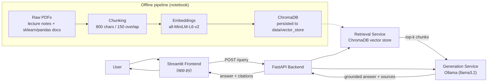
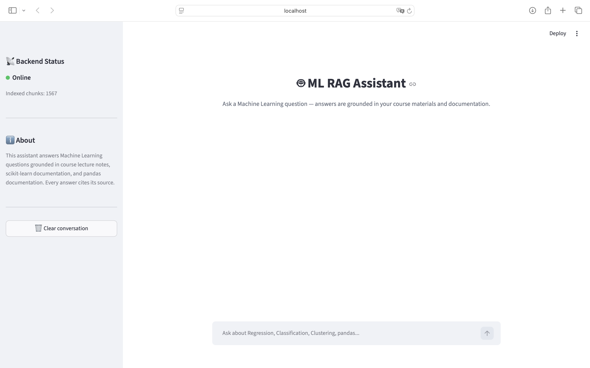
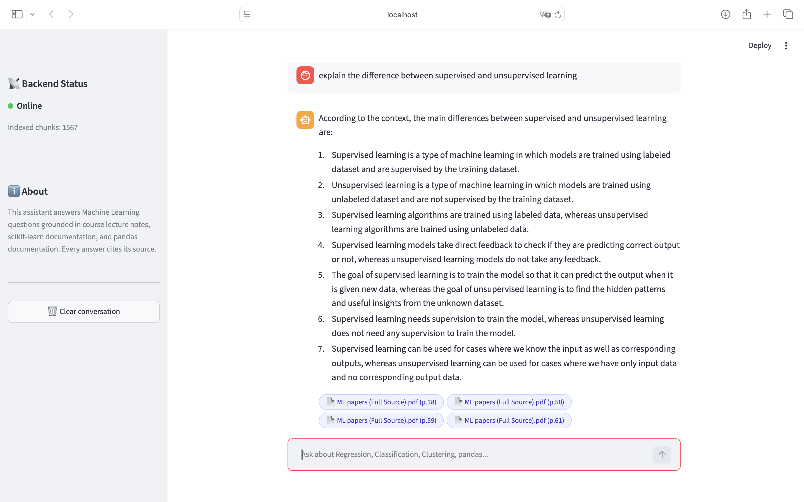

# ML Study Assistant — RAG-Powered Document Q&A

A Retrieval-Augmented Generation (RAG) web application that answers Machine Learning study
questions using a locally-run LLM, grounded strictly in a curated knowledge base of lecture
notes and library documentation (scikit-learn, pandas). Every answer cites the source document
and page it came from.

## Overview

This project was built as an individual graduation project (Level 2 Summer Training). It takes
raw PDF documents, cleans and chunks them, embeds them into a vector database, and serves a
grounded question-answering pipeline through a FastAPI backend and a Streamlit chat frontend.
The assistant answers **only** from the retrieved context — if the knowledge base doesn't
contain the answer, it says so instead of guessing.

## Architecture



## Tech Stack

| Layer | Technology |
|---|---|
| LLM | Ollama — `llama3.2` (local) |
| Embeddings | `sentence-transformers/all-MiniLM-L6-v2` (384-dim) |
| Vector store | ChromaDB (persistent, local) |
| Backend | FastAPI, Pydantic, Uvicorn |
| Frontend | Streamlit |
| Notebook / data prep | Python, pandas, pypdf |
| Testing | Pytest + FastAPI TestClient |

## Project Structure

```
rag-assistant-project/
├── backend/
│   ├── app/                  # FastAPI app, routes, services, config
│   ├── data/                 # vector store copied in from the notebook
│   ├── tests/                # pytest tests for /query
│   ├── Dockerfile
│   └── requirements.txt
├── frontend/
│   ├── app.py                 # Streamlit chat interface
│   ├── api_client.py          # wrapper for calling the backend API
│   └── requirements.txt
├── data/
│   ├── raw_documents/          # source PDFs (lecture_notes, sklearn_docs, pandas_docs)
│   └── vector_store/            # persisted ChromaDB collection
├── notebooks/
│   ├── rag_pipeline.ipynb       # full pipeline: load → chunk → embed → retrieve → evaluate
│   └── evaluation_results.csv
├── .gitignore
└── README.md
```

## Domain & Data

The knowledge base covers **classical Machine Learning** concepts and the two Python libraries
most used to implement them:

- **Lecture notes**: a 120-page Machine Learning course PDF (regression, classification,
  clustering, and related theory)
- **scikit-learn documentation**: 10 pages covering Linear Models, Logistic Regression,
  Nearest Neighbors, Decision Trees, Ensembles, SVM, Clustering, Cross-validation,
  Preprocessing, and Metrics
- **pandas documentation**: 7 pages covering indexing, group-by, merging/joining, reshaping,
  categorical data, and handling missing data

| Metric | Value |
|---|---|
| Source documents | 18 PDFs |
| Total pages | 169 |
| Parsing | 100% text-extractable via `pypdf` — no OCR needed |
| Chunk size / overlap | 800 characters / 150 characters (~19%) |
| Total chunks indexed | 1,567 |
| Average chunk length | 764 characters |

Chunk size was chosen to keep a full definition, formula, or code example intact while staying
small enough for precise retrieval; the overlap reduces the chance that a concept spanning a
chunk boundary gets cut in half.

## Setup

### Prerequisites
- Python 3.10+
- [Ollama](https://ollama.com) installed and running locally, with the model pulled:
  ```
  ollama pull llama3.2
  ```

### 1. Run the notebook (builds the vector store)
```
cd notebooks
jupyter notebook rag_pipeline.ipynb
# Run all cells — this persists the ChromaDB collection to data/vector_store/
```

### 2. Backend
```
cd backend
python -m venv .venv
source .venv/bin/activate      # Windows: .venv\Scripts\activate
pip install -r requirements.txt
cp .env.example .env           # adjust values if needed
uvicorn app.main:app --reload
```
Backend runs at `http://localhost:8000` — Swagger docs at `http://localhost:8000/docs`.

### 3. Frontend
```
cd frontend
python -m venv .venv
source .venv/bin/activate
pip install -r requirements.txt
cp .env.example .env           # set API_BASE_URL
streamlit run app.py
```

## Environment Variables

> Adjust these to match the exact variable names used in your `.env` files if they differ.

**Backend (`backend/.env`)**

| Variable | Example | Description |
|---|---|---|
| `OLLAMA_MODEL` | `llama3.2` | Ollama model used for generation |
| `VECTOR_STORE_PATH` | `data/vector_store` | Path to the persisted ChromaDB collection |
| `COLLECTION_NAME` | `ml_rag_assistant` | ChromaDB collection name |
| `EMBEDDING_MODEL` | `all-MiniLM-L6-v2` | Sentence-transformers model used for query embedding |
| `ALLOWED_ORIGINS` | `http://localhost:8501` | CORS origin(s) allowed to call the API |

**Frontend (`frontend/.env`)**

| Variable | Example | Description |
|---|---|---|
| `API_BASE_URL` | `http://localhost:8000` | Base URL of the FastAPI backend |

## API Reference

### `GET /health`
Returns service status.

### `POST /query`
Retrieves relevant chunks, builds a grounded prompt, and returns an answer with citations.

**Request body**
```json
{ "question": "What is the difference between Ridge and Lasso regression?" }
```

**Response body**
```json
{
  "answer": "Ridge regression uses an L2 penalty on the coefficients... [Linear Models, p.1]",
  "sources": [
    "Linear Models — scikit-learn documentation.pdf (p.1)",
    "Linear Models — scikit-learn documentation.pdf (p.2)"
  ]
}
```

**curl example**
```bash
curl -X POST http://localhost:8000/query \
  -H "Content-Type: application/json" \
  -d '{"question": "How does K-means clustering work?"}'
```

## Evaluation Results

10 sample questions were tested end-to-end against the deployed pipeline (full details and
retrieved sources in `notebooks/evaluation_results.csv`):

| # | Question | Result |
|---|---|---|
| 1 | Difference between Ridge and Lasso regression | Partial |
| 2 | How does K-means clustering work? | Correct |
| 3 | What is logistic regression used for? | Correct |
| 4 | How does K-Nearest Neighbors classify a point? | Correct |
| 5 | What is a Random Forest and how does it relate to bagging? | Partial |
| 6 | How do you handle missing data in pandas? | Correct |
| 7 | What does `groupby` do in pandas? | Correct |
| 8 | Supervised vs. unsupervised learning | Correct |
| 9 | Purpose of a Support Vector Machine | Correct |
| 10 | How to select rows and columns in a DataFrame | Correct |

**Score: 8/10 correct, 2/10 partial, 0/10 hallucinated.**

**Main failure case:** scikit-learn/pandas pages were saved as "Print to PDF," so sidebar
navigation and footer text leaked into the extracted content, fragmenting retrieval for some
generic questions. **Mitigation:** added a `clean_page_text()` step to strip boilerplate before
chunking, and increased retrieved chunks (`k`) from 4 to 6 — which fixed the affected questions.

## Screenshots

> Add screenshots of the running app here (frontend chat view + a sample grounded answer with
> citations).

```


```

## Notes

- Repo remote: `git remote add origin https://github.com/rawannx/rag-assistant-app.git`
- The raw PDF corpus and the persisted vector store are excluded from git via `.gitignore`.
  Anyone cloning the repo should re-run `notebooks/rag_pipeline.ipynb` to regenerate
  `data/vector_store/` before starting the backend.
